# Credit_Risk_Analysis

## Overview of the Analysis 
In this analysis we used machine learning techniques to build and evaluate models based on a credit card dataset. The models will then be used to predict credit card risk. In this project we used the imbalance-learn and scikit-learn libraries to build and evaluate six machine learning models. The methods and respective algorithms that were used to create the models are as follows:

1) Naive Random Oversampling -> RandomOverSampler algorithm 
2) SMOTE Oversampling -> SMOTE algorithm
3) Undersampling -> ClusterCentroids algorithm
4) Combination (Over and Under) Sampling -> SMOTEENN algorithm
5) Balanced Random Forest Classifier -> BalancedRandomForestClassifier algorithm
6) Easy Ensemble Adaboost Classifier -> EasyEnsemblerClassifier

## Results 

### Naive Random Oversampling 

The accuracy score and report below were generated after using the RandomOverSampler algorithm.

* Balanced Accuracy Score: 65%
* Precision Score for High Risk: 1%
* Precision Score for Low Risk: 100%
* Recall Score for High Risk: 62%
* Recall Score for Low Risk: 68%

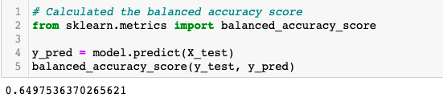

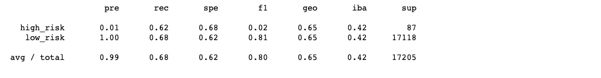

---

### SMOTE Oversampling 

The accuracy score and report below were generated after using the SMOTE algorithm.

* Balanced Accuracy Score: 64%
* Precision Score for High Risk: 1%
* Precision Score for Low Risk: 100%
* Recall Score for High Risk: 63%
* Recall Score for Low Risk: 66%

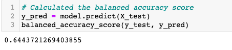

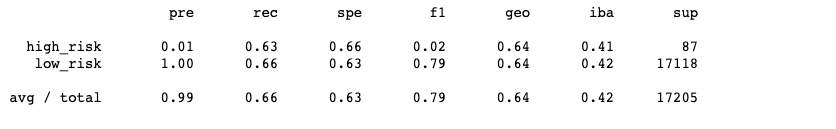

---

### Undersampling

The accuracy score and report below were generated after using the ClusterCentroids algorithm.

* Balanced Accuracy Score: 64%
* Precision Score for High Risk: 1%
* Precision Score for Low Risk: 100%
* Recall Score for High Risk: 61%
* Recall Score for Low Risk: 45%

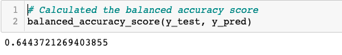

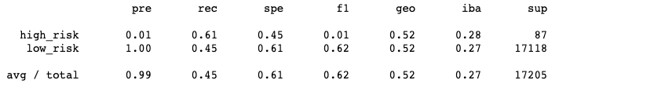

---

### Combination (Over and Under) Sampling

The accuracy score and report below were generated after using the SMOTEENN algorithm.

* Balanced Accuracy Score: 53%
* Precision Score for High Risk: 1%
* Precision Score for Low Risk: 100%
* Recall Score for High Risk: 70%
* Recall Score for Low Risk: 57%

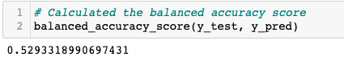

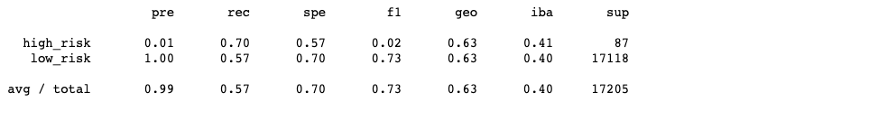

---

### Balanced Random Forest Classifier 

The accuracy score and report below were generated after using the BalancedRandomForestClassifier algorithm.

* Balanced Accuracy Score: 67%
* Precision Score for High Risk: 73%
* Precision Score for Low Risk: 100%
* Recall Score for High Risk: 34%
* Recall Score for Low Risk: 100%

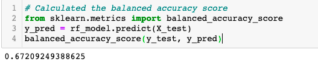

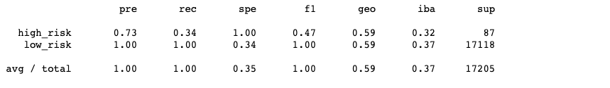

---

### Easy Ensemble Adaboost Classifier 

The accuracy score and report below were generated after using the EasyEnsembleClassifier algorithm.

* Balanced Accuracy Score: 93%
* Precision Score for High Risk: 7%
* Precision Score for Low Risk: 100%
* Recall Score for High Risk: 91%
* Recall Score for Low Risk: 94%

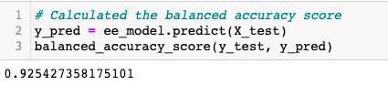

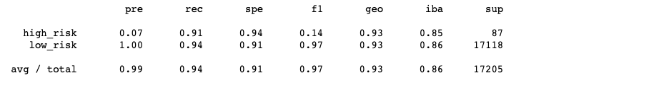

